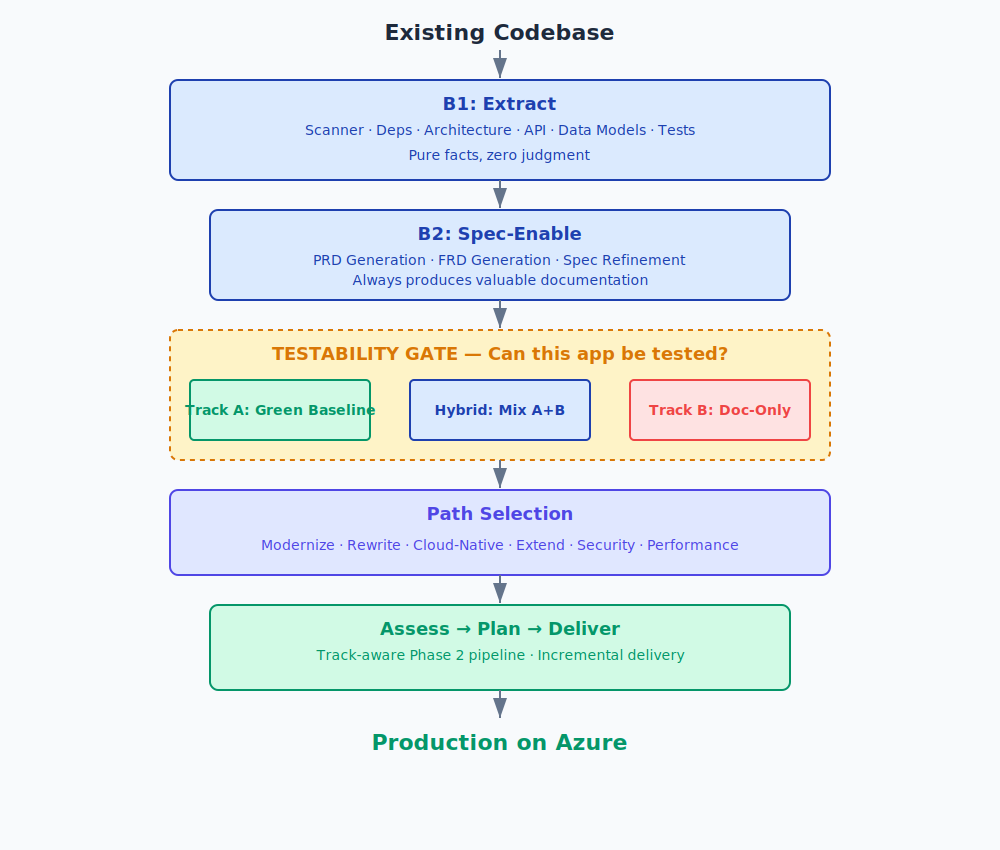
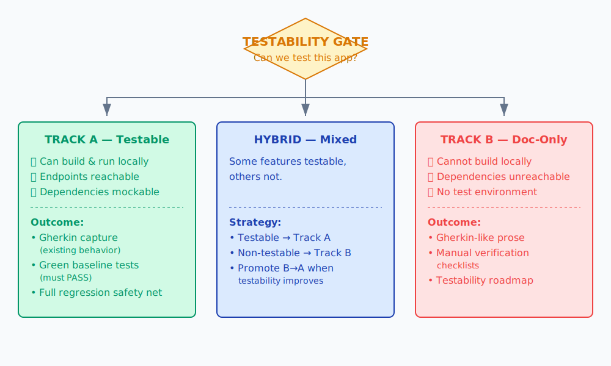
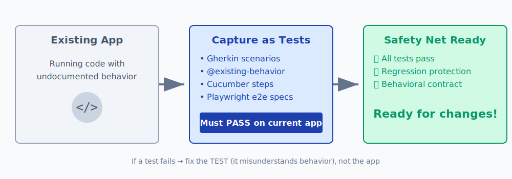

# Brownfield: Modernizing Existing Code

Transform existing codebases into spec-driven projects, then modernize, extend, or rewrite — with testability-aware testing that adapts to your app's constraints.



## The Approach

Brownfield is harder than greenfield because you're not starting from a blank slate. spec2cloud handles this with a **common trunk + branching track** design:

1. **Extract** what exists (always valuable documentation)
2. **Generate specs** from the extraction (PRD + FRDs)
3. **Assess testability** (can we actually test this app?)
4. **Capture behavior** as tests or documentation (depending on testability)
5. **Choose a path** and deliver increments

The first three steps always run and always produce valuable artifacts — even if the app can't be tested.

---

## Phase B1: Extract

Six extraction skills scan the codebase without making any judgments:

| Skill | Output |
|-------|--------|
| Codebase Scanner | Technology inventory: languages, frameworks, entry points |
| Dependency Inventory | Complete catalog of all dependencies with versions |
| Architecture Mapper | Components, layers, data flow, Mermaid diagrams |
| API Extractor | Existing API contracts in OpenAPI format |
| Data Model Extractor | Database schemas, ERDs, relationships |
| Test Discovery | Existing test inventory, coverage, frameworks |

**The rule:** Document what IS, not what SHOULD BE. Zero judgment, zero recommendations.

**Human Gate:** Review extraction outputs for accuracy.

---

## Phase B2: Spec-Enable

Two generators create formal specifications from the extraction output:

- **PRD Generator** — Product Requirements Document reverse-engineered from the codebase (**Human Gate**)
- **FRD Generator** — Feature Requirement Documents with "Current Implementation" sections (**Human Gate**)
- **Spec Refinement** — Review through product + technical lenses (**Human Gate**)

**Result:** Your existing codebase now has the same specification foundation as a greenfield project — PRD, FRDs, tech stack, architecture docs, API contracts, and dependency inventory.

---

## The Testability Gate



This is the most important brownfield decision. After specs are generated, you assess whether the app can be tested:

**Checklist:**
- ☐ Can the application be built and started locally?
- ☐ Are external dependencies reachable, mockable, or fakeable?
- ☐ Can API endpoints be exercised?
- ☐ Can the UI be rendered and interacted with?
- ☐ Is there a working dev/test environment?
- ☐ Can the existing test suite be executed?

**Your decision determines the track:**

| Outcome | Track | What happens next |
|---------|-------|-------------------|
| All/most checked | **Track A** (Testable) | Green baseline — Gherkin + tests that pass on current app |
| Few/none checked | **Track B** (Doc-Only) | Behavioral documentation + manual verification checklists |
| Mixed | **Hybrid** | Track A for testable features, Track B for the rest |

**Human Gate:** This is a critical decision point — it shapes the entire rest of the workflow.

---

## Track A: Green Baseline



**For testable apps.** Capture existing behavior as executable tests that PASS against the current codebase. This creates a regression safety net before any changes.

For each feature area (iterative, one at a time):

### Step 1: Gherkin Capture
Generate Gherkin scenarios describing what the app **does today** — not what it should do.
- Input: FRD with "Current Implementation" section + running app
- Output: `.feature` files tagged `@existing-behavior`
- Covers: happy paths, known edge cases, error handling

### Step 2: Test Scaffolding
Generate tests that **PASS** against current code (the opposite of greenfield's red baseline).
- Cucumber step definitions from Gherkin scenarios
- Playwright e2e specs from user flows
- Unit tests for critical business logic

### Step 3: Green Verification
Run all generated tests. **They must all pass.**
- If a test fails → fix the TEST (it misunderstands current behavior), not the app
- Iterate until the entire green baseline passes

**Human Gate:** Per feature — review Gherkin accuracy and test results.

**Result:** A complete regression safety net. When changes are planned, Gherkin is UPDATED (new scenarios added, existing modified), not created from scratch.

---

## Track B: Documentation-Only

**For apps that can't be tested** — unreachable dependencies, no dev environment, legacy infrastructure that can't be replicated locally.

Track B produces structured behavioral documentation even when executable tests aren't possible:

### Behavioral Scenarios
Gherkin-like Given/When/Then prose added to FRDs — not executable, but structured for consistency and future conversion:

```gherkin
# Documentation-only (not executable)
@documentation-only @feature-auth
Scenario: User logs in with valid credentials
  Given a registered user
  When the user submits valid credentials
  Then the user receives a session token
  And the user is redirected to the dashboard
```

### Manual Verification Checklists
Per-feature checklists for manual testing after changes:
```
- [ ] Login with valid credentials → redirects to dashboard
- [ ] Login with invalid credentials → shows error message
- [ ] Session expires after configured timeout
```

### Testability Roadmap
Documents what would need to change to make each feature testable — which dependencies to mock, what infrastructure is missing, estimated effort.

**Human Gate:** Per feature — review behavioral docs and checklists.

**Track Promotion:** Features can be promoted from Track B → Track A when testability improves. Never demote from A → B.

---

## Choose Your Path

After Track A/B completes, choose which paths to pursue:

| Path | When to Use | Assessment Skill | Planning Skill |
|------|-------------|-----------------|----------------|
| **Modernize** | Update tech debt, deprecated deps | modernization-assessment | modernization-planner |
| **Rewrite** | Replace components entirely | rewrite-assessment | rewrite-planner |
| **Cloud-Native** | Move to containers/Azure | cloud-native-assessment | cloud-native-planner |
| **Extend** | Add new features | — | extension-planner |
| **Security** | Address vulnerabilities | security-assessment | security-planner |
| **Performance** | Fix bottlenecks | performance-assessment | — |

Multiple paths can be selected simultaneously. **Human Gate:** Path selection is a major decision.

---

## Assessment, Planning & Delivery

**Phase A: Assess** — Each selected path runs its assessment skill with adaptive depth. Produces findings and Architecture Decision Records (ADRs).

**Phase P: Plan** — Each planner generates increments with **behavioral deltas**:
- Track A features get Gherkin deltas (new/modified scenarios)
- Track B features get documentation updates + manual checklist changes

**Phase 2: Delivery** — Track-aware:
- **Track A:** Full greenfield pipeline — update Gherkin → update tests → contracts → implementation → deploy
- **Track B:** Reduced pipeline — update docs → contracts → implementation → manual verification → deploy

---

## Brownfield Advantages

- **Always produces value** — Extraction + specs are useful even without testing
- **Adapts to constraints** — Testable apps get full test coverage; non-testable apps get structured docs
- **Preserve existing investment** — Keep working features, change only what matters
- **Regression safety** — Track A's green baseline catches unintended breakage
- **Continuous delivery** — Deploy after each increment, not at the end
- **Track promotion** — Features graduate from doc-only to tested as infrastructure improves
- **Parallel paths** — Modernize tech while extending features simultaneously
