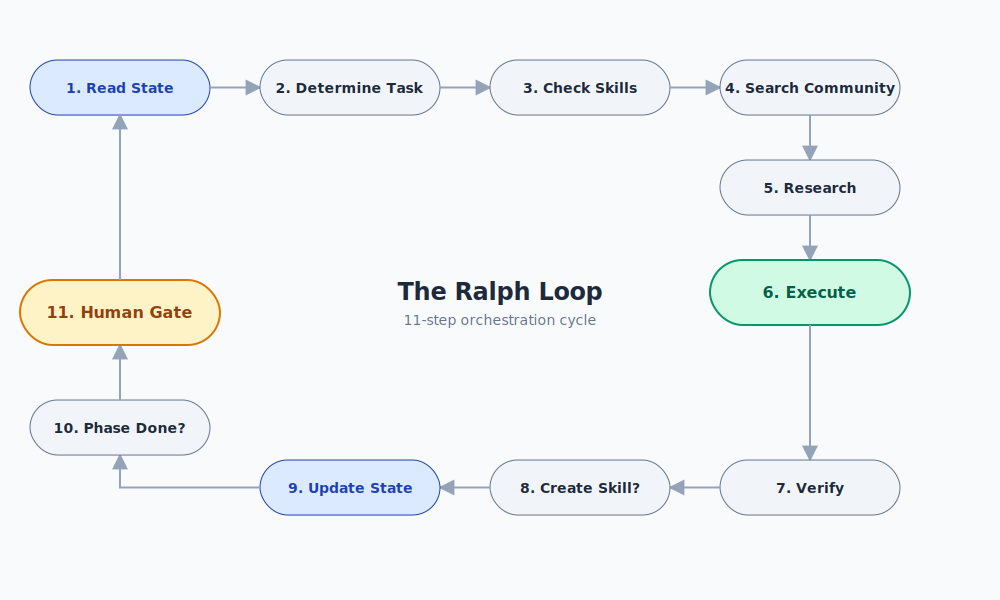
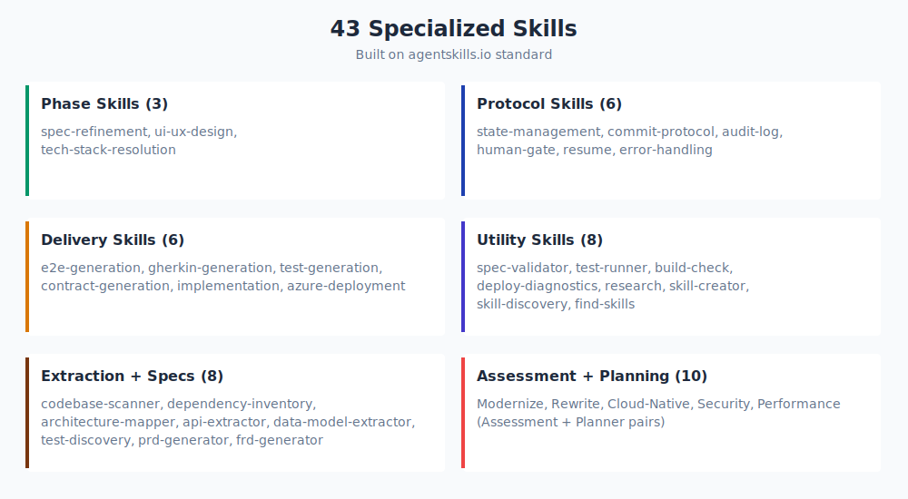
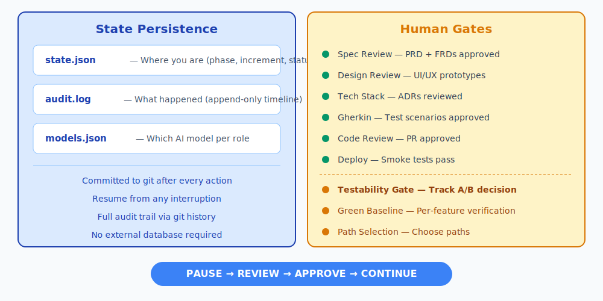
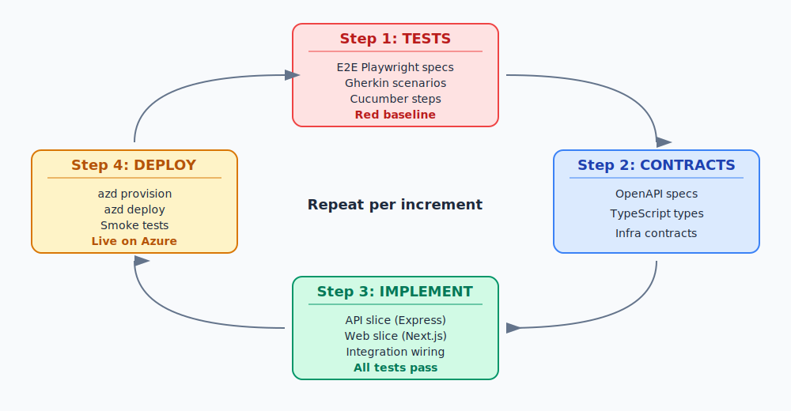

# Core Concepts

Before diving into workflows, learn the four building blocks that power spec2cloud.

## The Ralph Loop

The orchestrator runs in a repeating 11-step cycle called the Ralph Loop. Each iteration: read current state → determine the next task → find or create the right skill → execute → verify → update state. This loop is the heartbeat of spec2cloud — it drives every phase from specification to deployment.

The loop maintains deterministic progress through `state.json`, committed to git after every action. If you stop, crash, or close your laptop — the loop picks up exactly where it left off.

→ [Deep dive: Architecture](architecture.md)

---

## Skills

Skills are reusable procedures that do the actual work. Each skill has a SKILL.md file with instructions, optional references, and scripts. The orchestrator discovers and invokes them automatically.

**43 skills in 7 categories:**

| Category | What they do | Count |
|----------|-------------|-------|
| Phase | Drive discovery (spec refinement, UI/UX, tech stack) | 3 |
| Delivery | Execute increments (tests, contracts, implementation, deploy) | 6 |
| Protocol | Ensure consistency (state, commits, audit, gates, resume, errors) | 6 |
| Utility | Support tools (validator, runner, build check, diagnostics) | 8 |
| Extraction | Scan existing codebases (scanner, deps, arch, API, data, tests) | 6 |
| Assessment | Evaluate paths (modernize, rewrite, cloud-native, security, perf) | 5 |
| Planning | Generate increments (modernize, rewrite, cloud-native, extend, security) | 5+4 |

Skills follow the [agentskills.io](https://agentskills.io) standard. You can create your own or install community skills from [skills.sh](https://skills.sh).

→ [Deep dive: Skills Catalog](skills.md)

---

## State & Human Gates

Two systems make spec2cloud reliable and safe:

**State persistence** — All progress lives in `.spec2cloud/state.json` and `audit.log`, committed to git after every action. This means:
- Resume from any interruption point
- Share progress via git push/pull
- Full audit trail through git history
- No external database required

**Human gates** — The orchestrator pauses at critical checkpoints and waits for your approval. Nothing ships without your sign-off: spec review, design review, tech stack, Gherkin scenarios, code review, deployment verification, and (for brownfield) the testability gate.

→ [Deep dive: State & Human Gates](state-and-gates.md)

---

## Increments

Work is delivered in increments — small, self-contained units that each leave the application fully working and deployed.

Every increment follows the same 4-step cycle:

1. **Tests** — Generate e2e specs, Gherkin scenarios, and unit test stubs. Establish a red baseline (tests fail, as expected).
2. **Contracts** — Generate OpenAPI specs, shared TypeScript types, and infrastructure contracts. These enable parallel implementation.
3. **Implementation** — Write code in parallel slices (API + Web), then wire together (Integration). Red tests turn green.
4. **Deploy** — Provision Azure resources, deploy, run smoke tests, verify with full regression.

After each increment: main is green, deployment is live, docs are current. Then the next increment begins.

→ [Greenfield Guide](greenfield.md) | [Brownfield Guide](brownfield.md)

---

## What's Next?

Choose your path:

- **Building something new?** → [Greenfield Guide](greenfield.md)
- **Working with existing code?** → [Brownfield Guide](brownfield.md)
- **Want examples?** → [Walkthroughs](examples/)
