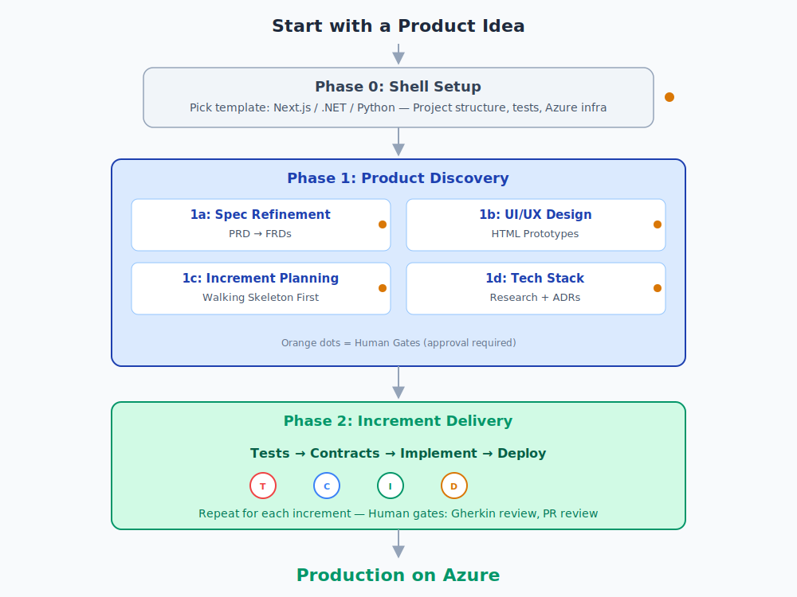
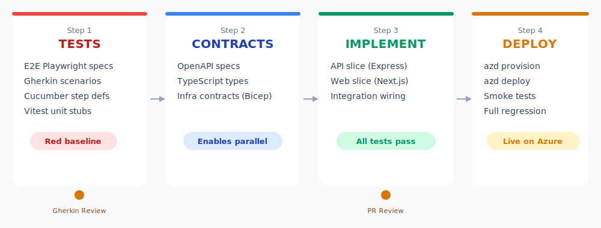

# Greenfield: Building New Applications

Build production-ready applications from a product specification, deployed to Azure. Two phases: Discovery (understand what to build) and Delivery (build and ship it).

## Phase 0: Shell Setup

Pick a shell template that matches your tech stack. The shell provides project structure, test frameworks, Azure infrastructure templates, and CI/CD workflows.

| Template | Language | Stack |
|----------|----------|-------|
| **Next.js** | TypeScript | React + Express + PostgreSQL |
| **.NET** | C# | ASP.NET Core + Entity Framework |
| **Agentic .NET** | C# | ASP.NET Core + Claude AI Agent SDK |
| **Agentic Python** | Python | FastAPI + Claude AI Agent SDK |

## Phase 1: Product Discovery

### 1a — Spec Refinement

Your PRD is reviewed through product and technical lenses. Up to 5 refinement passes ensure completeness: edge cases, feasibility, clarity. The PRD is then broken into individual FRDs (Feature Requirement Documents).

**Human Gate:** Review and approve refined PRD and FRDs before proceeding.

### 1b — UI/UX Design

Interactive HTML prototypes are generated from the approved specs and served via HTTP for review.

**Human Gate:** Review prototypes, provide feedback, approve designs.

### 1c — Increment Planning

FRDs are organized into ordered delivery increments. The first increment is always a "walking skeleton"—the minimal end-to-end path that proves the architecture works.

### 1d — Tech Stack Resolution

Every technology choice is researched, evaluated, and documented as an Architecture Decision Record (ADR).

**Human Gate:** Review tech stack choices and ADRs.

## Phase 2: Increment Delivery

### Step 1: Tests First

- **E2E specs** (Playwright) from UI flows
- **Gherkin scenarios** from FRDs
- **Unit tests** (Vitest) scaffolded
- All tests run and establish a "red baseline" (they fail, as expected)

**Human Gate:** Review and approve Gherkin scenarios.

### Step 2: Contracts

- **OpenAPI specs** define API boundaries
- **Shared TypeScript types** for request/response DTOs
- **Infrastructure contracts** (Azure resources via Bicep)
- Contracts enable parallel implementation of API and Web slices

### Step 3: Implementation

Three parallel slices:

- **API Slice**: Express routes, services, models (tested with Vitest + Supertest)
- **Web Slice**: Next.js pages, components (tested with builds + component tests)
- **Integration Slice**: Wire API + Web together (tested with Cucumber + Playwright e2e)

API and Web run in parallel. Integration is sequential after both complete. Red baseline tests turn green.

**Human Gate:** PR review before deployment.

### Step 4: Deploy & Verify

- **Azure deployment** via azd + Bicep
- **Smoke tests**: health checks, API health, frontend load, critical user paths
- **Full e2e regression** against deployed URL
- **Rollback + GitHub issue** if smoke tests fail

After Step 4 completes, loop back to Step 1 for the next increment.

---

## Quality Guarantees

Every increment ships with:
- ✓ 100% test coverage (unit, integration, e2e)
- ✓ All tests passing on main
- ✓ Live deployment to Azure
- ✓ Rollback capability on failure
- ✓ Zero manual deployment steps
