# Skills Catalog

spec2cloud uses 43 specialized skills following the [agentskills.io](https://agentskills.io) standard. Each skill is a reusable procedure stored in `.github/skills/` with a SKILL.md file and optional references, scripts, and assets.

## How Skills Work

The orchestrator discovers and uses skills through a simple flow: check `.github/skills/` for local skills first, then search `skills.sh` for community skills. If a new reusable pattern emerges during work, the skill-creator skill packages it for future use.

Each skill has:
- A SKILL.md with YAML frontmatter (name, description, triggers)
- Optional `references/` for supporting documentation
- Optional `scripts/` for automation
- Optional `assets/` for templates and resources

## Greenfield Skills (22)

### Phase Skills
Drive the one-time discovery process.

| Skill | Purpose |
|-------|---------|
| spec-refinement | Review PRDs/FRDs through product and technical lenses (max 5 passes) |
| ui-ux-design | Generate interactive HTML prototypes from specs |
| tech-stack-resolution | Research and resolve every technology choice with ADRs |

### Delivery Skills
Execute the repeating increment cycle.

| Skill | Purpose |
|-------|---------|
| e2e-generation | Generate Playwright e2e test specs from UI flows |
| gherkin-generation | Convert FRDs into BDD scenarios (.feature files) | Modes: `new-feature` (default), `capture-existing` (brownfield Track A) |
| test-generation | Create Cucumber step definitions + Vitest unit tests | Modes: `red-baseline` (default), `green-baseline` (brownfield Track A) |
| contract-generation | Produce OpenAPI specs, TypeScript types, Bicep contracts |
| implementation | Write code in parallel slices to make failing tests pass |
| azure-deployment | Provision and deploy to Azure via azd + Bicep |

### Protocol Skills
Ensure consistency and reliability across all operations.

| Skill | Purpose |
|-------|---------|
| state-management | Read/write .spec2cloud/state.json |
| commit-protocol | Structured git commits after every action |
| audit-log | Append-only action history |
| human-gate | Pause for human approval at critical transitions |
| resume | Restore state and continue after interruption |
| error-handling | Diagnose and recover from failures |

### Utility Skills
Support tools used throughout.

| Skill | Purpose |
|-------|---------|
| spec-validator | Validate spec completeness and consistency |
| test-runner | Execute test suites and report results |
| build-check | Verify builds pass |
| deploy-diagnostics | Diagnose deployment failures |
| research-best-practices | Use MCP tools to research approaches |
| skill-creator | Package new reusable patterns as skills |
| skill-discovery | Search skills.sh for community skills |

## Brownfield Skills (21)

### Extraction Skills (Phase B1)
Pure-fact scanners that document what exists.

| Skill | Purpose |
|-------|---------|
| codebase-scanner | Technology inventory: languages, frameworks, entry points |
| dependency-inventory | Complete dependency catalog |
| architecture-mapper | Components, layers, data flow |
| api-extractor | Existing API contracts and endpoints |
| data-model-extractor | Database schemas and relationships |
| test-discovery | Existing test coverage and gaps |

### Spec Generation (Phase B2)

| Skill | Purpose |
|-------|---------|
| prd-generator | Reverse-engineer PRD from codebase |
| frd-generator | Generate FRDs with "Current Implementation" sections + Track B behavioral docs |

### Brownfield Track Skills (after Testability Gate)

After extraction and spec generation, a **testability gate** determines which track each feature follows:

| Track | Skill | Mode | Purpose |
|-------|-------|------|---------|
| A (Testable) | gherkin-generation | `capture-existing` | Gherkin scenarios describing current app behavior |
| A (Testable) | test-generation | `green-baseline` | Tests that PASS against existing code |
| A (Testable) | test-runner | verification | Verify green baseline — all tests pass |
| B (Doc-Only) | frd-generator | behavioral-docs | Behavioral scenarios + manual verification checklists |

### Assessment Skills (Phase A)

| Skill | Purpose |
|-------|---------|
| modernization-assessment | Tech debt, deprecated deps, anti-patterns |
| rewrite-assessment | Component replacement analysis |
| cloud-native-assessment | Container/serverless readiness |
| security-assessment | Vulnerability identification |
| performance-assessment | Bottleneck analysis |

### Planning Skills (Phase P)

| Skill | Purpose |
|-------|---------|
| modernization-planner | Plan modernization increments |
| rewrite-planner | Plan rewrite increments |
| cloud-native-planner | Plan cloud-native migration increments |
| extension-planner | Plan new feature increments |
| security-planner | Plan security remediation increments |

> All planners now produce **behavioral deltas** alongside increments: Gherkin deltas for Track A features, behavioral documentation updates for Track B features.

### Cross-cutting Skills

| Skill | Purpose |
|-------|---------|
| adr | Create Architecture Decision Records |
| bug-fix | Diagnose and fix bugs |

## Find Skills

The `find-skills` skill searches for both local and community skills by keyword or capability.
