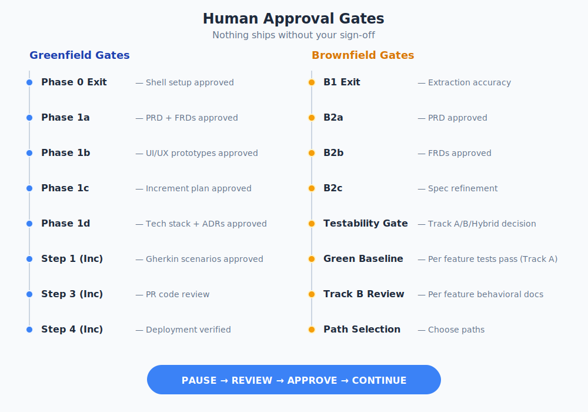

# State Management & Human Gates

Two systems ensure spec2cloud is reliable and safe: persistent state for resumability, and human gates for quality control.

## State Persistence



All state lives in the `.spec2cloud/` directory and is committed to git after every action.

### state.json — The Snapshot

This file captures the current position:

```json
{
  "phase": "2-delivery",
  "increment": 1,
  "step": "implementation",
  "status": "in_progress",
  "human_gates": {
    "spec_review": "approved",
    "design_review": "approved",
    "gherkin_review": "approved"
  }
}
```

### Brownfield State

For brownfield projects, state.json includes additional tracking:

```json
{
  "mode": "brownfield",
  "phase": "B3",
  "brownfield": {
    "testability": "partial",
    "track": "hybrid",
    "testabilityChecklist": {
      "canBuild": true,
      "externalDepsReachable": false,
      "apiExercisable": true,
      "uiRenderable": true,
      "devEnvExists": true,
      "existingTestsRunnable": true
    },
    "featureTracks": {
      "auth": "A",
      "search": "A",
      "reporting": "B"
    },
    "greenBaseline": {
      "auth": { "scenarios": 12, "testsPass": true },
      "search": { "scenarios": 8, "testsPass": true }
    }
  }
}
```

The `featureTracks` map determines which delivery pipeline each feature uses in Phase 2.

### audit.log — The Timeline

An append-only log of every action taken:

```
[2024-01-15T10:23:00Z] spec-refinement PASS prd.md refined (pass 3 of 5)
[2024-01-15T11:45:00Z] ui-ux-design PASS 4 screens prototyped
[2024-01-15T14:02:00Z] gherkin-generation PASS 12 scenarios generated
```

### models.json — Model Configuration

Assigns AI models to roles:
```json
{
  "orchestrator": "claude-opus-4.6",
  "codebase-analysis": "claude-sonnet-4",
  "implementation": "claude-sonnet-4"
}
```

### Why Git?

- Resume from any point after interruption
- Share progress across machines via git push/pull
- Full audit trail visible in git history
- No external database required
- Branching enables parallel experimentation

## Human Gates



Nothing ships without explicit human approval. The orchestrator pauses at critical transitions and waits for your sign-off.

### Gate Locations

| Gate | When | What You Review |
|------|------|----------------|
| Spec Review | After Phase 1a | Refined PRD and FRDs |
| Design Review | After Phase 1b | UI/UX prototypes |
| Tech Stack Review | After Phase 1d | Technology choices and ADRs |
| Gherkin Review | After Phase 2 Step 1 | BDD test scenarios |
| PR Review | After Phase 2 Step 3 | Implementation code |
| Deploy Review | After Phase 2 Step 4 | Deployed application |
| Extraction Review | After Phase B1 | Accuracy of extracted documentation |
| PRD Review | After Phase B2a | Generated PRD matches codebase reality |
| FRD Review | After Phase B2b | Generated FRDs with Current Implementation |
| Testability Gate | After Phase B2 | Can this app be tested? Track A/B/Hybrid decision |
| Green Baseline | After Track A per feature | Gherkin + tests pass against current app |
| Track B Review | After Track B per feature | Behavioral docs + manual checklists |
| Path Selection | Before Phase A | Which paths to pursue (modernize/rewrite/etc.) |
| Assessment Review | After Phase A | Assessment findings |

### How Gates Work

When the orchestrator reaches a gate:
1. It updates state.json with gate status "pending"
2. It commits state and presents results for review
3. You review the artifacts
4. You approve, request changes, or reject
5. The orchestrator records your decision and either proceeds or loops back

### Testability Gate (Brownfield)

The most important brownfield gate. After specs are generated, you assess testability:

**Checklist:**
- Can the app be built and started locally?
- Are external dependencies reachable or mockable?
- Can API endpoints be exercised?
- Can the UI be rendered and interacted with?
- Is there a working dev/test environment?

**Outcomes:**
- **Track A** — All/most checked → Green baseline (Gherkin + passing tests)
- **Track B** — Few/none checked → Documentation-only (behavioral docs + manual checklists)
- **Hybrid** — Mixed → Track A for testable features, Track B for the rest
